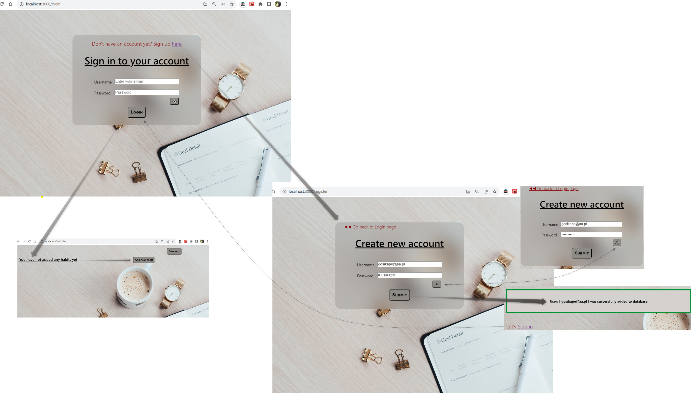
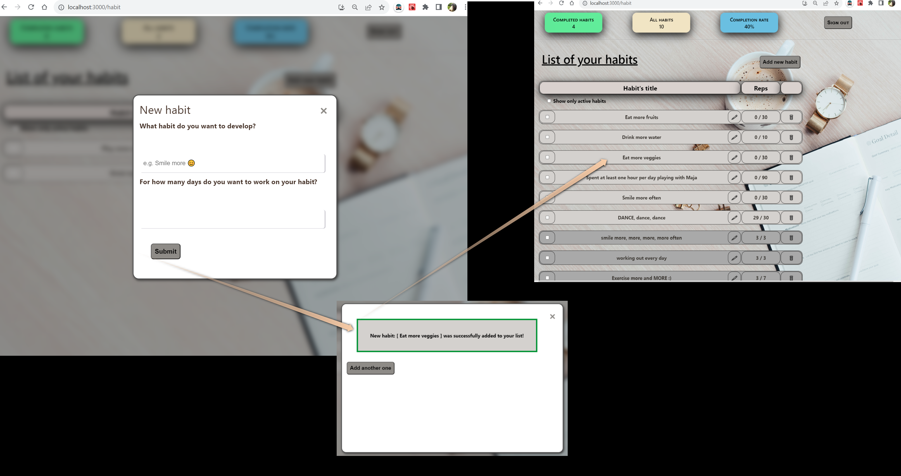
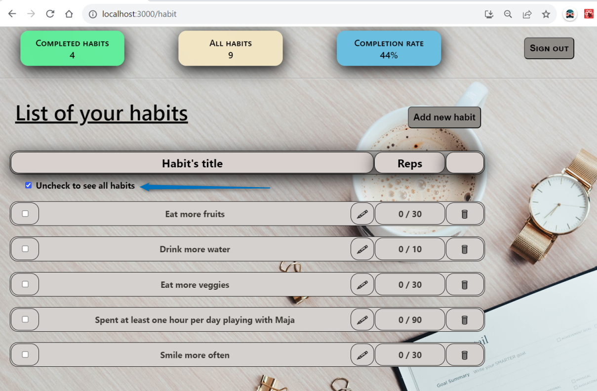
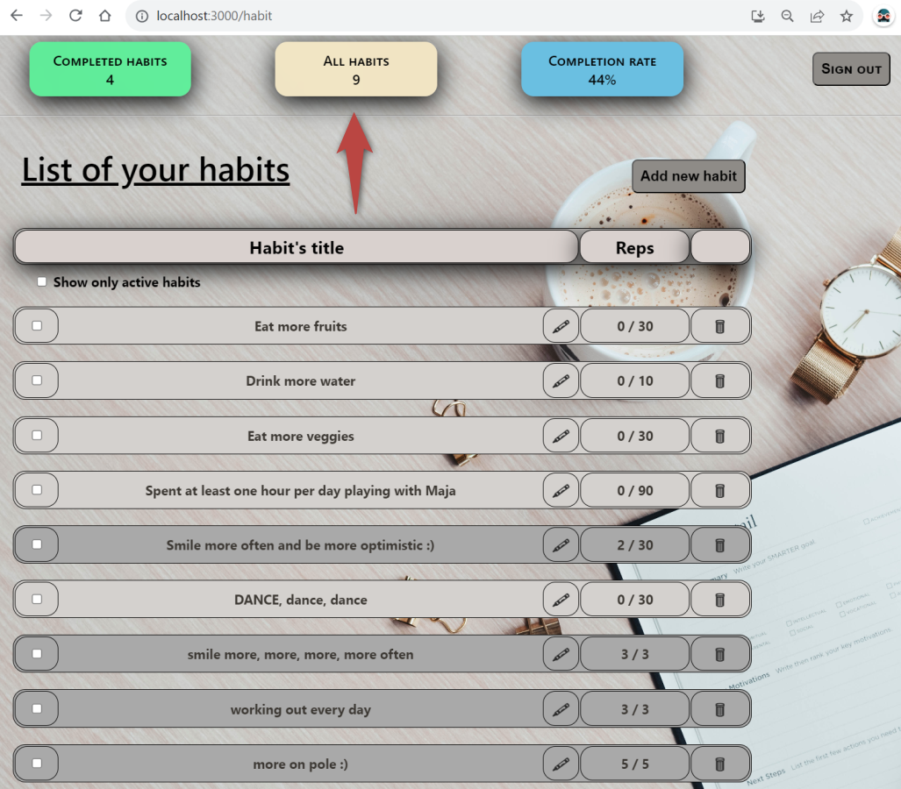

# Habit Tracker App (FE)

## Table of Contents

- [Description](#description)
- [Features](#features)
- [Screenshots](#screenshots)
- [Getting Started](#getting started)
- [Challenges](#challenges)
- [Bootstrapped with Create React App](#create react app)
- [Contributors](#contributors)


## Description

Habit Tracker is a single-page app taht allows you keep a record of your day to day habits. It is made using NodeJS 
and React ts, React Routes, Passport JS

### Video presentation

## Features

* create an account with using email and password
* log in and authenticate the user with the passport-local strategy
* add, remove and edit (e.g. ractivate) habits
* filter out only active habits
* mark finished reps and change the habit status from ‘in progress’ to ‘completed’ when you're done.
* brief summary of all time performance (number of added versus completed habits and completetion rate)

## Screenshots

* Sign up or create a new account using your email address



* Create new habit



* Manage your habits - preview, edit or delete your habits


* Filter your habits to see only active ones



* Keep track of your performance



## Getting Started
Below you'll find the instructions for setting up the project locally
Clone repo and install dependencies

### Clone the repo
git clone https://github.com/gosikape/HabitsTrackerFront.git

### Install dependencies

```
cd habit-tracker-front 
npm install
```
###  Start development server

```
npm start
```

The app should be running at: http://localhost:3000 

## Challenges

The project is in an early stage and it will be surely still develop. Nevertheless I learned a lot while building it and hope to learn a lot more.


## Bootstrapped with Create React App


This project was bootstrapped with Create React App
For the detailed description of available scripts see [CRA Documentation](https://github.com/facebook/create-react-app).
[Create React App documentation](https://facebook.github.io/create-react-app/docs/getting-started).


## Contributors
Created with ❤️ by Małgorzata Oleś

